# Strata System Architecture & Formal Specifications

## 1. Saga Orchestration Execution Sequence

```mermaid
sequenceDiagram
    autonumber
    participant SF as AWS Step Functions
    participant Pay as Payment Service
    participant Inv as Inventory Service
    participant Ship as Shipping Service
    participant DLQ as SQS FIFO DLQ

    SF->>Pay: ReservePayment (SagaCmd)
    Pay-->>SF: 200 SUCCESS
    SF->>Inv: ReserveInventory (SagaCmd)
    alt Inventory Depleted (Fault)
        Inv-->>SF: 400 STOCK_DEPLETED
        Note over SF: Trigger Compensation Routine
        SF->>Pay: RefundPayment (Compensate)
        Pay-->>SF: 200 REFUND_COMPLETED
        SF->>DLQ: Record Poison Pill Failure
    else Stock Available
        Inv-->>SF: 200 SUCCESS
        SF->>Ship: DispatchShipping (SagaCmd)
        Ship-->>SF: 200 SUCCESS
        Note over SF: Saga Completed Successfully
    end
```

## 2. Distributed Consistency Guarantees
- **Isolation Level**: Sagas relax strict ACID Isolation ($I$) in favor of **BASE** (Basically Available, Soft state, Eventual consistency).
- Countermeasures against dirty reads include semantic locking (`status = "PENDING_RESERVE"`) and commutative compensating transactions.
