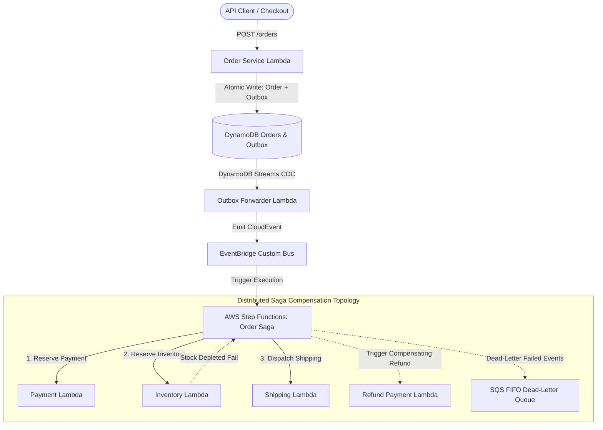

# Strata Distributed Saga (2022)

[](https://golang.org)
[](https://aws.amazon.com)
[](https://www.terraform.io)
[](https://opensource.org/licenses/MIT)

> Enterprise-grade **Distributed Transaction Saga Orchestrator** and **Transactional Outbox Engine** on AWS engineered with **AWS Step Functions**, **Amazon DynamoDB**, **Amazon EventBridge**, **SQS FIFO**, and **Go** (2022).

---

## 1. System Architecture & Topology



---

## 2. Core Distributed Systems Capabilities

### 2.1 Backward Compensating Transactions
- **Forward Steps**:
  1. `ReservePayment`: Authorizes funds with payment gateway.
  2. `ReserveInventory`: Decrements warehouse inventory.
  3. `DispatchShipping`: Creates delivery label with carrier.
- **Rollback Sequence**:
  - If `ReserveInventory` fails (e.g. stock depleted), Step Functions catches the fault and triggers `CompensatePayment` to issue a full refund, preserving eventual consistency across service boundaries without 2-phase locking.

### 2.2 Exactly-Once Processing via Idempotency Keys
- Handlers perform conditional DynamoDB writes (`attribute_not_exists(idempotency_key)`), neutralizing duplicate EventBridge or SQS retries.
- 24-hour DynamoDB TTL ensures automatic cleanup of old idempotency tracking records.

### 2.3 Transactional Outbox Pattern
- Combines business entity persistence with message publishing into a single atomic DynamoDB `TransactWriteItems` call, completely eliminating dual-write anomalies.

### 2.4 Resilience Engineering
- **Exponential Backoff with Full Jitter**: Neutralizes thundering herd against downstream services.
- **Sliding Window Circuit Breaker**: Fails fast during third-party payment partner downtime.
- **Bulkhead Isolation**: Prevents slow logistics carriers from exhausting system resources.

---

## 3. Infrastructure as Code (Terraform)

```bash
# Initialize Terraform provider plugins
terraform init

# Validate configuration
terraform validate

# Plan provisioning on AWS
terraform plan
```
